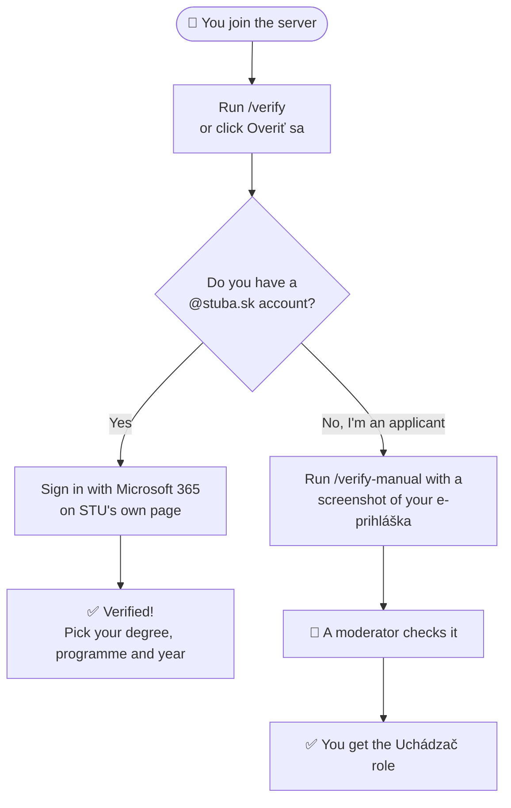

# 🎓 STUard

**Friendly student verification for the STU MTF Discord server**

Show you belong to STU, and get the right roles and channels automatically.

---

## ✨ What STUard does

- 🔐 **Checks that you really study or work at STU**, using your school account
- 🏷️ **Gives you the right roles**: student, applicant, teacher or graduate, plus your degree, programme and year
- 🚪 **Opens the channels that fit you**, like the ones for your year and programme
- 🙈 **Never sees your password**, and keeps as little about you as possible

## 🚀 Getting verified

1. **Get your link.** Run `/verify` or click **Overiť sa** in the verification channel. Only you can see the link, and it works for 10 minutes.
2. **Confirm it's you on Discord.** The page checks that your browser is logged into the same Discord account, so nobody else can use your link.
3. **Sign in with your school account.** Click **Prihlásiť sa cez Microsoft 365** and log in with your `@stuba.sk` account. Your password goes only to STU's sign-in page.
4. **Pick your studies.** Choose your degree, programme and year with `/profile`, and your channels open up.

> 💡 **No Microsoft 365 button, or sign-in not working?** Run `/verify-manual` and upload a screenshot of your UIS portal instead. A moderator will take it from there.

## 🏷️ Roles you can get

| If you are… | You get |
|---|---|
| 🎒 a current student | **Študent**, plus your year (e.g. `2-BC`) and programme (e.g. `Bc. Mechatronika`) |
| 📝 an applicant | **Uchádzač** |
| 🧑‍🏫 a teacher | **Vyučujúci**, always confirmed by a moderator |
| 🎓 a graduate | **Absolvent** |
| 👋 no longer studying | **Bývalý študent**: you keep the general channels, but not the study ones |

## 🛡️ Your privacy

- 🔑 **Your password never reaches the bot.** You type it only on STU's own sign-in page.
- 🧮 **No name, email or AIS ID is stored.** The bot keeps a scrambled one-way fingerprint, only so that one school account can't verify two Discord accounts.
- 🖼️ **Screenshots are deleted** as soon as a moderator decides.
- 📦 **You're in control.** `/privacy` shows everything the bot keeps about you, and `/forget-me` deletes it.

## 💬 Commands

| Command | What it does |
|---|---|
| `/verify` | Get your personal sign-in link |
| `/verify-manual` | Verify with a screenshot (applicants, or when sign-in doesn't work) |
| `/profile` | See your status and set your degree, programme and year |
| `/privacy` | See the data the bot keeps about you |
| `/forget-me` | Delete your data and your verified roles |

## ❓ Questions

<b>Does the bot see my password?</b>

 

No. You sign in on STU's own login page, and the bot only receives confirmation of who you are and what kind of account you have. Your password never passes through the bot.

<b>Why do I have to confirm my Discord account in the browser?</b>

 

So your verification link is useless to anyone else. Even if someone got hold of it, they would have to be logged into your Discord account to use it.

<b>I'm an applicant and don't have a school account yet</b>

 

That's fine. Run `/verify-manual`, choose the applicant role and attach a screenshot of your e-prihláška. A moderator reviews it, and the screenshot is deleted right after.

<b>Why am I asked to verify again?</b>

 

Once a year, between 20 September and 31 October, everyone re-verifies so the roles stay accurate. You'll get reminders by DM before the deadline.

<b>Something isn't working</b>

 

Message a moderator on the server. They can look at your verification and help you out.

## 🛠️ Running your own copy

STUard is open source. To run it for your own server, follow the [setup guide](docs/SETUP.md).

## 📄 License

[GPL-3.0](LICENSE)
